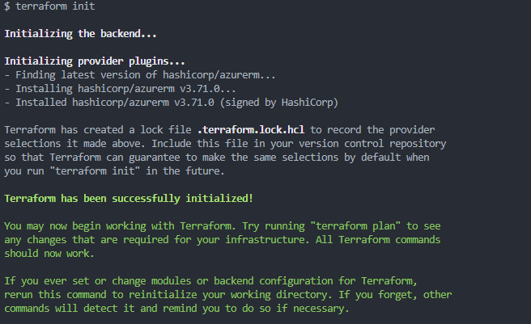
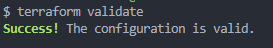
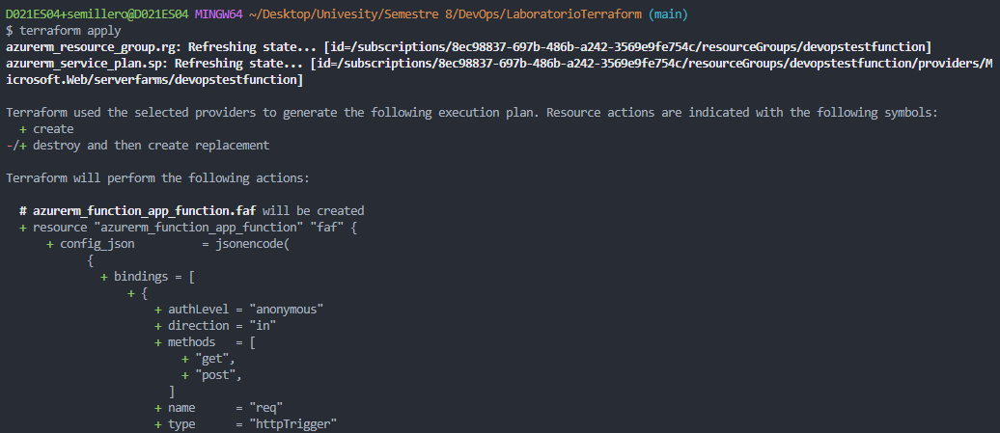
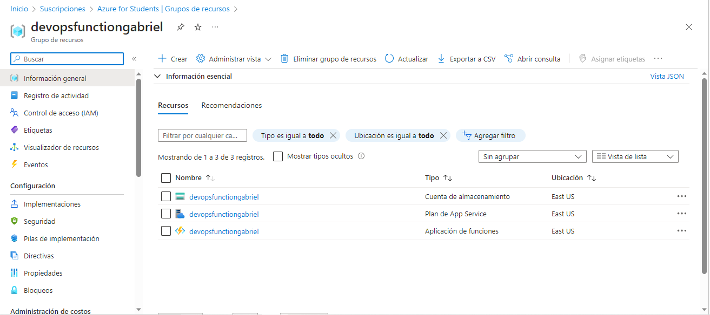

# azure-function-terraform

A continuación se mostraran los comandos más importantes para desplegar un grupo de recursos con terraform

## terraform Init

## terraform Validate

## terraform Apply

## Grupo de recursos

